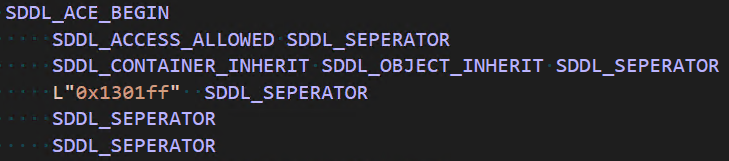
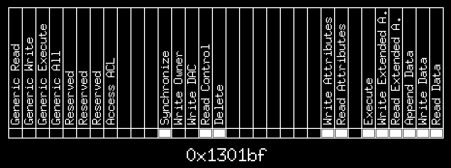

# Access Mask - Windows

## Introduction



Ok cool, what is this `0x1301ff`?

This program aims at easily understand access masks values without having to read three thousand msdn pages/navigate across billions of constants in `winnt.h` (obviously exaggerated).

You can paste an access mask such as `0x1301ff`, and you'll get a readable version of it, bit by bit.



Now I know.

## Tips

- To add/remove access from mask, click on the rectangles under each access name. If it's white, access is selected.
- You can choose the object type by pressing left/right keys. For now, it handles files/directories/named pipes access masks.
- You can copy the current displayed value by pressing Ctrl+C keys.
- You can paste a value you copied elsewhere by pressing Ctrl+v keys. Pasted value can be:
  - Base 2 (0b0101)
  - Base 8 (0o7861)
  - Base 10
  - Base 16 (0x101010)
- By maintaining pressure on alt key, you can activate bit that wouldn't be enabled otherwise. It can be used to test stuff if needed. Once released, the value will be fixed according to the current authorized mask.
- By pressing DELETE, you can reset the value to 0

## Build with icons on Windows

To embed icons/manifest in build, I use `github.com/tc-hib/go-winres`.

```bash
go-winres make
go build .
```

## Author

SOARES Lucas
